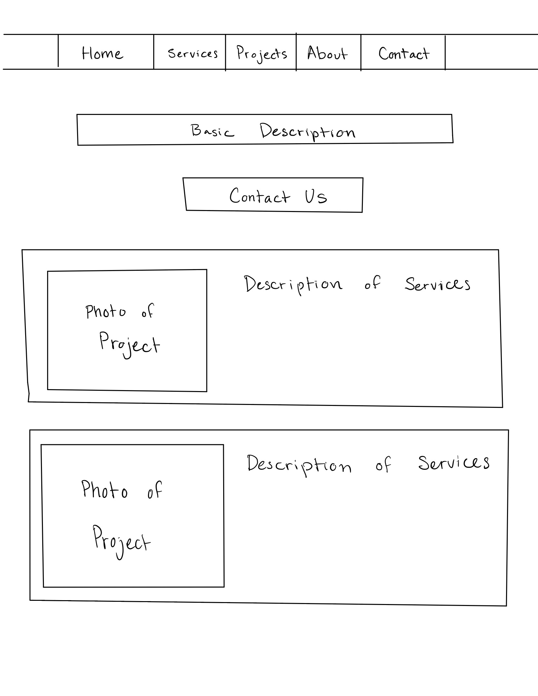

# Real Time Community Event Planner

## Introduction
This application allows users to discover and participate in local community events in real-time. It targets individuals looking to engage more with their local community, participate in events, or organize their own. Is a neighbor having a barbecue? Is the whole town getting together for a volleyball game? This is the place to find out.

## View the Project Plan

Here is a rough outline of what the app format would look like: 

## Key Features
- **Event Creation and Browsing:** Users can create events, browse upcoming events, and join them. Events range from local workshops and sports activities to neighborhood meetings and impromptu gatherings.
- **Real-Time Chat and Updates:** Utilizing WebSockets, the app offers real-time communication channels for each event, enabling instant attendee and organizer communication.
- **Interactive Maps:** Integrating Google and Apple maps to display events on interactive maps.
- **User Profiles and Authentication:** Features secure user authentication and profile customization.
- **Feedback and Ratings:** Enables attendees to provide event feedback and ratings, ensuring community safety and engagement.
- **Notifications and Alerts:** Customizable real-time notifications about event changes and updates.

## Technology Implementation
- **HTML:** Use of HTML for structuring the application’s web pages.
- **CSS:** Responsive and user-friendly interface design with CSS.
- **JavaScript:** Dynamic features like event registration and live chat implemented in JavaScript.
- **Web Services:** Integration of third-party APIs for enhanced functionality.
- **Authentication:** Secure user registration and login processes.
- **Database:** Robust data management for user and event information.
- **WebSocket:** Real-time data communication through WebSockets.
