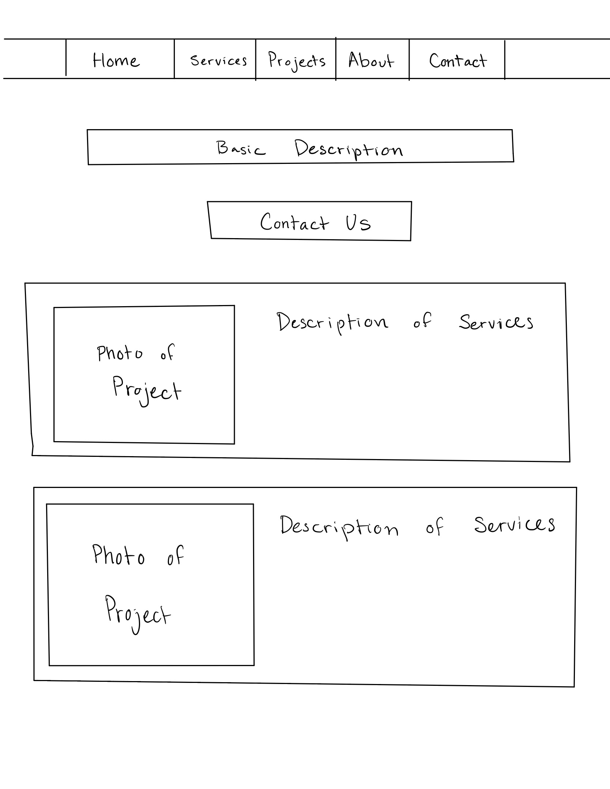

# Pillar Constructs Co. Website

## Introduction
This application is centered solely around a construction business that I will be starting with my friend. The idea is to give customers some tangible way to reach out to us and see what we're all about.

## View the Project Plan

Here is a rough outline of what the app format would look like: 

## STARTUP CSS IMPLEMENTATIONS
- I completely redid the project for part. I found that I wasn't too engaged in the idea of CommunityTogether (My last Project) so I decided to revamp it and create something that I will actually use.

## Key Features
- Service and Project Showcases: Detailed and visually appealing presentations of our services and past projects.
- Real-Time Contact Form: A straightforward and user-friendly form on the "Contact Us" page, ensuring you can reach out to us anytime.
- Responsive Design: A website design that looks great on any device, enhancing your browsing experience whether on desktop, tablet, or mobile.
- Accessibility and Usability: Prioritized navigation and information architecture for an intuitive user experience.

## Technology Implementation
- HTML & CSS: For structuring and styling our website, ensuring it's visually appealing and accessible.
- JavaScript: Enhances interactivity and user engagement on the site.
- Responsive Design: Implemented through CSS media queries, ensuring the site is fully functional and beautiful on any screen size.

## Index Tab (Home Page)
- This tab is the home page for the Pillar Constructs Co. website. It contains information regarding what we do and user reviews, and links to all of the different pages.

## About Tab
- This tab just gives some basic information on Me and Aaron (My business partner). We want customers to put a name to the company, and we want to appear human, as they say.

## Contact Tab
- This tab gives you the ability to contact us. There is currently some placeholder information and some text boxes that will allow connectivity in the future.

## Services Tab
- This tab just gives basic information on the services we provide. The hope is that in the future we will have actual images of us doing work on homes, but for now there are just stock images.

## Projects Tab
- This will be a list of our proudest accomplishments. The idea being that customers will be able to see our work and visualize what we can do for them.

## Assets Folder
- This contains a list of all of the photographs that I use in the website. Per standard use, similar to other websites

## Styles.css file
- This is where all of my fonts, styles, and ways of making the website look good are stored.

## STARTUP JAVASCRIPT IMPLEMENTATION

## Database.js file
- This is where I will host the data for the website in the future. It will keep track of user data, as well as when and where appointments are. It currently retains the information from the last project CommunityTogether. By the end of the project I should have the url changed.

## Login.html file
- This is our users are able to login to their accounts that they have with us. Currently there is no actual functionality, but the framework is in place. There is now a place to enter a username and a password, in addition to feedback loops that let the user know whether or not that is a valid username or password (currently all usernames and passwords will not work because there is no database).

## Chat.html file
- This is the tab where our customers will be able to talk to us directly concerning any complaints. I might take it out of the final product because I don't think that it is exceptionally useful right now, especially because we don't have many customers or a customer support team. But in the future I believe that it could be useful if our business takes off, so I will keep it in the background.

## main.java
- This is the file that contains all of the javascript for the project. It is centered largely around ease of access. It has several different functionalities such as a search bar to look through projects, toggleability on certain objects so the website doesn't take up massive amounts of screen space, in addition to a scroll wheel that will come into effect when there is more information regarding the business. The javascript also is a large function of the chat implementation and it functions as the catalyst for the storage of user information that we collect throuh logins.

## package.json
- This File contains default values for future mongoDB interactions

## server.js
- This file contains all of my server information at the current moment, including a basic framework for express and mongo use in the future.
  
## user.html
- This is the file that will have user information presented. I will still need to attach it to a websocket, but in the meantime it works alongside the login.html page to provide basic user functionality.
